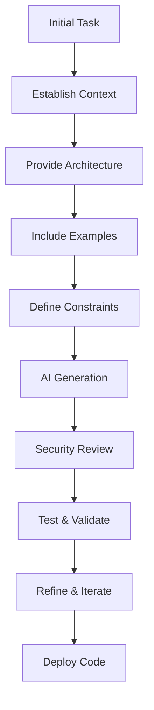

# Advanced AI Prompting: From Vibe Coding to Context Engineering

Here's the reality in 2025: **25% of new tech companies have AI write 95% of their code.** But here's the problem: **48% of that code has security holes.**

Today, you're going to learn how to be in the **safe 52%**—how to use AI to build code that actually works and doesn't have security problems.

## What You'll Learn

- How to organize your thoughts BEFORE coding (the planning thing)
- When to start fresh chats with AI and when not to
- How to tell if AI made something insecure
- How to break big projects into small tasks
- How to stay in the loop as AI tools change



## The 2025 landscape: vibe coding reality check

- **25% of Y Combinator Winter 2025 startups** have 95% AI-generated codebases
- **48% of AI-generated code** contains security vulnerabilities
- **Context windows** now reach 256K-1M tokens but remain finite
- **Debugging AI code** takes 45% longer than expected for most developers

The challenge isn't getting AI to write code—it's getting AI to write **good, secure, maintainable** code.

## Understanding tokens & context windows

### What are tokens?

Tokens are how AI models break down text. Think of them as roughly:
- **1 token** ≈ 4 characters or 0.75 words
- "Hello" = 1 token
- "Hello world" = 2-3 tokens
- This sentence ≈ 20-25 tokens

### Why tokens matter

AI models have a **context window**—the maximum amount of information they can "see" at once. Modern models support massive windows:
- Claude 3.5 Sonnet: 200K tokens
- GPT-4 Turbo: 128K tokens
- Some models: 1M+ tokens

**But here's the critical insight:** Even with 200K tokens, you can't waste them.

### The math

- **100K tokens** ≈ 75,000 words ≈ 300-page book
- When you hit the limit, AI "forgets" everything before it
- Adding massive code files, logs, or previous conversations eats tokens fast

### Why this drives context engineering

When you understand tokens, you realize:
1. **Fresh chats matter** - Don't contaminate your window with unrelated history
2. **Context selection is critical** - Choose only relevant files and dependencies
3. **Conciseness pays** - Clear, brief prompts beat rambling requests
4. **Multi-session context matters** - You can't rely on "remember this from earlier"

This is why the Long-term Context Management Protocol (LCMP) exists. You're strategically managing a finite, expensive resource.

## When to Start a Fresh Chat: Understanding Memory Limits

### The Context Rot Problem: What Research Shows

Here's the bad news: **AI performance degrades significantly as context length increases.** Research from 2024-2025 tested 12 of the most popular AI models on really long contexts and found that **11 out of 12 models dropped below 50% of their short-context performance at 32,000 tokens.**

This phenomenon is called **context rot**: as your chat gets longer, the model's ability to actually use all that information decreases. More context doesn't mean better answers—it means worse answers.

### Three Problems That Happen With Long Chats

#### 1. The "Lost in the Middle" Effect

AI models have an attention bias: they remember what's at the **beginning and end** of conversations really well, but **forget what's in the middle.**

Real example:
- **Message 50:** You say "Make the layout right-aligned"
- **Message 150:** Your layout is already in the middle (forgotten)
- **Message 200:** AI starts suggesting left-aligned designs
- **You:** "But we said right-aligned three hours ago!"
- **AI:** Has no memory of it

This isn't a bug—it's how AI brains work. It's harder for them to find information buried in the middle of huge conversations.

#### 2. Context Anxiety (The Shortcut Problem)

Here's something weird researchers discovered: **Claude Sonnet becomes aware that it's running out of context and gets anxious about it.** When the model thinks it's near the end of its window, it:

- Takes shortcuts to wrap up tasks
- Leaves things incomplete
- Makes hasty decisions instead of careful ones
- Sometimes does this even when there's plenty of room left!

It's like when you're writing an essay and suddenly realize you're on the last page, so you rush the ending—even if you actually have space left.

#### 3. Compression Losses (The Cascading Problem)

When your chat gets too long, AI tries to "summarize" everything so it can keep going. But here's what actually happens:

**First compression (Chat gets really long):**
- AI summarizes what you've been working on
- Deletes the old conversation
- Keeps the summary to continue from

- **Result:** You lose some details, but 80-90% is preserved

**Second compression (New summary gets too long):**
- AI summarizes the summary
- More details lost
- Now at maybe 60-70% of original information

**Third compression:**
- Summarizing the summary of the summary
- Now you're down to maybe 40-50% of original information
- Requirements become vague
- Details disappear

This is exactly like making a photocopy of a photocopy of a photocopy—each copy gets a little bit worse.

### What Gets Lost in Compression?

Research shows that when summaries are created, **important details are paraphrased or omitted entirely.** What typically disappears:

- Specific formatting requirements ("right-aligned" becomes just "aligned")
- Security constraints (gets forgotten in the summary)
- Edge cases you mentioned earlier
- Code style preferences
- Performance targets ("sub-200ms" just becomes "fast")

### The Context Window Reality

Think of your context window like a notebook:
- **Modern models:** 100K-200K page notebook (huge!)
- **But:** You can't use all 100K pages for one conversation
- **The problem:** When you try to fill it, the first 50K pages become basically invisible to AI
- **The solution:** Don't rely on memory—use fresh paper

### The Simple Solution: Fresh Chat Protocol

**When your chat reaches 100+ messages back-and-forth, start a new chat.**

Don't try to make AI compress everything. Instead:

1. **Make a checklist document** of important decisions and requirements
2. **Start a fresh chat** (clean notebook)
3. **Paste your checklist at the beginning** of the new chat
4. **Say what you're working on:** "I'm doing task #3: [specific task]"
5. **Include relevant code** from your previous work
6. **Continue from there**

### Why Fresh Chat Beats Compression

**Fresh context:**
- AI has 100% clarity on requirements
- No "lost in the middle" effect
- All decisions are visible
- Performance stays high
- Takes maybe 2-3 minutes to set up

**Compressed context:**
- AI has maybe 60% of information after 2+ compressions
- Vague requirements lead to vague code
- Takes 5-10 minutes for summarization overhead
- Performance is degraded
- Gets worse each time you compress again

### Best Practice Rule

- ✅ **Do this:** Start fresh chats for new tasks or when 100+ messages in
- ✅ **Do this:** Keep a document of important decisions and architecture
- ✅ **Do this:** Paste your decision document at the start of new chats
- ❌ **Don't do this:** Try to compress old conversations
- ❌ **Don't do this:** Compress, then compress again (exponential information loss)
- ❌ **Don't do this:** Rely on "remember earlier" after the first compression

## The Better Way to Build: Plan → List → Build

### Why Planning First Wins

Here's something counterintuitive: the best way to use AI is to *spend more time planning*, not less.

Think about it like writing an essay:
- **Bad approach:** Start typing randomly and hope it works out
- **Good approach:** Make an outline first, then write

Teams using AI found they got way better results (way fewer bugs!) when they:
1. **Talked through the idea** with AI first
2. **Made a checklist** of everything to build
3. **Built one thing at a time** instead of everything at once

### Why AI Needs You to Plan First

AI is like a really smart but literal employee:
- It does exactly what you ask
- If your instructions are vague, the result is messy
- It can't ask "but what about...?" unless you tell it to
- It does great with clear, specific checklists

Unlike humans, AI can't improvise. So planning first = way better results.

### The Three-Step Workflow: A Practical Example

#### Step 1: Talk It Through (the planning conversation)

Instead of jumping straight to code, have a conversation with AI:

```text
You: "I want to build a feature where users can upload a profile picture"
AI: "Cool! A few questions:
    - Should the picture be a square or round?
    - How big can the file be?
    - What happens if someone uploads a huge 100MB file?"
You: "Oh, good points. Square, max 5MB, show an error if too big"
AI: "Got it. So we need to..."
```

This conversation catches confusion early—when it's easy to fix.

#### Step 2: Make Your Checklist

Write down everything you need to build in a simple checklist. This is your instruction manual for AI.

Example checklist for a profile feature:

- [ ] 1. Set up database storage for profile info
- [ ] 2. Build the profile saving code
- [ ] 3. Create the API endpoint (the thing the website talks to)
- [ ] 4. Add validation (make sure the data looks right before saving)
- [ ] 5. Build the form on the website
- [ ] 6. Make the form send data to the server
- [ ] 7. Add security (make sure nobody can hack this)
- [ ] 8. Write tests (make sure it actually works)
- [ ] 9. Test it manually (try it yourself)

**Pro tip:** Each checklist item should be small enough that you can do it in one chat with AI—like 30 minutes of work.

#### Step 3: Build One Thing at a Time

For each item on your checklist:

1. **Start a fresh chat** with AI
2. **Paste your whole checklist** at the top
3. **Paste any relevant code** from your project
4. **Say what you want:** "I'm doing #3: Create the API endpoint"
5. **Let AI build it**
6. **Test it works**
7. **Save your work** (git commit)
8. **Move to the next item** in a fresh chat

### Why This Actually Works

- **No confusion:** AI has one clear job per chat
- **Way fewer mistakes:** Everything is broken down into small pieces
- **Easy to fix bugs:** When something breaks, you know exactly which step it was
- **Good code quality:** AI can focus on doing one thing really well
- **You can test as you go:** After each step, you verify it works

### Real Results

Students and developers using this approach report:
- **Fewer bugs:** About 40% less buggy code
- **Less frustration:** Way less time debugging
- **Cleaner organization:** Easy to see what you did and when
- **Better learning:** You understand each part since it was built one at a time
- **Easier to show someone:** "Here's what step 3 does, here's step 4" is easier to explain

## From prompts to context engineering

### The fundamental shift

**Old way (2023-2024):** Focus on crafting perfect prompts
**New way (2025):** Manage context strategically across sessions

### Long-term Context Management Protocol (LCMP)

1. **Fresh contexts for new features** - Don't mix unrelated tasks
2. **Document architectural decisions** - Include them in prompts
3. **Clear tool results** - Remove noise when switching focus
4. **Structured notes** - Maintain context across sessions

Example context setup for your Go projects:
```
Project: Portfolio site
Stack: Go 1.25, Echo framework, templ templates, SQLite, HTMX
Structure: /handlers, /models, /views, /static
Current feature: Adding user comments
Related files: models/user.go, handlers/auth.go
Security requirements: XSS protection, rate limiting
Performance target: Sub-200ms response time
```

## Advanced prompting patterns

### 1. Architecture-first prompting

**Explain what you're building and how it fits with your existing code:**

```text
"I'm building a Go project using Echo and SQLite. I've organized
my code like this: /handlers for web stuff, /models for database
operations, /views for HTML.

I want to add a profile editing feature. Can you look at how I
structured my existing contact handler and user model, then build
the profile system the same way?

Here's my existing code:
[paste handler or model file]

Keep the same patterns and style."
```

### 2. Test-driven prompting

**Ask AI to write tests for what you want, then implement to pass those tests:**

```text
"Write tests that check if password strength validation works.
Make sure you test edge cases like:
- Empty passwords
- Passwords that are too short
- Missing uppercase or lowercase letters
- Missing numbers
- Security issues like <script> tags that hackers use

Search the internet for best practices on password validation
in Go. Then write the ValidatePassword function to pass all
those tests and make it secure."
```

### 3. Two-stage security prompting

**Stage 1: Build the feature (in one chat)**
```text
"Help me build a comment system for my blog. I need:
- A form where users can write comments
- Save comments to the database
- Display all comments on the page
- Make sure the form validates the data

Just get it working first. Don't worry about security yet."
```

**Stage 2: Security review (in a new chat)**
```text
"Now I want you to act like a security expert. Look at this
comment code and find everywhere a hacker could break in.

Check for: XSS attacks, SQL injection, CSRF, and any other
security problems. Tell me exactly what could go wrong and how
to fix it."
```

### 4. Few-shot example prompting

**Show AI examples of code you like, and it'll follow that style:**

```text
"Here's how I built my contact handler. I really like this style:
[paste your existing handler code here]

Can you build a profile handler that follows this same pattern?
Keep the structure, the way you check GET vs POST, how you
validate, and how you return responses. I want my code to look
consistent throughout my project."
```

### 5. Chain-of-thought for complex problems

```
Let's optimize this database query step by step:

1. First, analyze the current query performance
2. Identify N+1 queries or missing indexes
3. Consider caching opportunities
4. Evaluate if we need pagination
5. Check for unnecessary data fetching
6. Propose optimized solution with benchmarks

Current query:
[paste query]

Table structure:
[paste schema]

Current performance: 800ms for 1000 records
```

### 6. Role-based perspective prompting

```
Review this authentication system from multiple perspectives:

As a SECURITY ENGINEER:
- Check for timing attacks
- Verify password hashing (bcrypt/argon2)
- Look for session fixation vulnerabilities

As a PERFORMANCE ENGINEER:
- Identify bottlenecks
- Check for unnecessary database calls
- Review caching strategy

As a FRONTEND DEVELOPER:
- Verify CORS configuration
- Check error message exposure
- Review token storage approach
```

## Common intermediate mistakes to avoid

### 1. Context contamination
**Problem:** Using same chat session for login system, then image uploads
**Solution:** Start fresh chats for unrelated features

### 2. Missing cross-file dependencies
**Problem:** Asking to modify handler without showing related models
**Solution:** Include all relevant files and their relationships

### 3. Vague performance requirements
**Bad:** "Make it faster"
**Good:** "Optimize this query to handle 10K+ records in under 200ms"

### 4. Ignoring edge cases
**Bad:** Not specifying behavior for empty data
**Good:** "Handle empty arrays, null values, special characters (emoji, RTL text)"

### 5. Skipping security validation
**Fact:** 86% of AI code fails XSS defense
**Solution:** Always run Stage 2 security review

### 6. Over-trusting hallucinated packages
**Problem:** 22% of AI suggestions include non-existent packages
**Solution:** Verify all import statements and dependencies

## Security-first prompting

### The sobering statistics

- **86%** of AI code vulnerable to XSS attacks
- **88%** vulnerable to log injection
- **70%** of Java code fails security tests
- **37.6%** increase in critical vulnerabilities with unsupervised iteration

### Security prompt template

```
Requirements:
1. Validate all user input
2. Sanitize output (HTML encoding for web display)
3. Use parameterized queries (never string concatenation)
4. Implement rate limiting
5. Add appropriate logging (without sensitive data)
6. Handle errors gracefully (no stack traces to users)

After implementing, review for OWASP Top 10:
- SQL Injection
- XSS (stored and reflected)
- CSRF
- Insecure Direct Object References
- Security Misconfiguration
```

## GitHub Copilot power features (2025)

### Advanced features you might not know

**Contextual agents:**
- `@workspace` - Searches entire codebase
- `@terminal` - Sees command output
- `@vscode` - Accesses editor state

**Slash commands:**
- `/tests` - Generate comprehensive test files
- `/docs` - Create documentation
- `/fix` - Auto-fix issues
- `/explain` - Get detailed explanations

**Multi-file editing:**
- Copilot Edits can modify multiple files simultaneously
- Maintains consistency across changes

**Example usage:**
```
@workspace Find all handlers that don't have rate limiting
/tests Create integration tests for the auth system
@terminal Why is this test failing?
```

## Practical exercises

### Exercise 1: Context engineering challenge

**Task:** Add a notification system to your portfolio

**Step 1:** Write basic prompt
**Step 2:** Enhance with:
- Full architectural context
- Database schema
- Existing notification patterns
- Security requirements
- Performance constraints

**Compare:** How much better is the AI output?

### Exercise 2: Test-driven development

**Task:** Create email validation function

1. Write 10 test cases (valid, invalid, edge cases)
2. Have AI implement function to pass tests
3. Add security review pass
4. Verify no regex DoS vulnerabilities

### Exercise 3: Security review simulation

Take existing code from your portfolio:
1. Ask AI to act as security researcher
2. Request OWASP Top 10 analysis
3. Get specific remediation steps
4. Implement fixes
5. Re-review to confirm resolution

### Exercise 4: Performance optimization

```
Current situation:
- Page load time: 3 seconds
- Database query: 500ms
- Multiple N+1 queries detected

Task: Use AI to:
1. Profile the bottlenecks
2. Suggest optimizations
3. Implement caching strategy
4. Add database indexes
5. Measure improvements
```

## Debugging with AI assistance

### Effective error prompting

**Bad:**
```text
"My code doesn't work, fix it"
[code dump]
```

**Good:**
```text
"I'm getting this error when I try to upload a profile picture:

[paste your error message]

Here's my upload handler code:
[paste the function]

What's going wrong? Can you help me figure out what's
happening and how to fix it?"
```

### Context-rich debugging template

```
Environment:
- Go 1.25, Echo v4, SQLite
- Running locally with Air hot reload
- Error appeared after adding [specific change]

Steps to reproduce:
1. Start server with `air`
2. Navigate to /profile
3. Click "Edit"
4. Submit form with [specific data]

Expected: Profile updates successfully
Actual: 500 error with [specific message]

Relevant logs:
[paste logs with timestamps]

Recent changes:
[list recent commits or modifications]

Help me identify the root cause and fix.
```

## Staying current with AI tools

### The meta-skill: Learning to learn

**Monthly routine:**
1. Check official changelogs
   - github.blog/changelog
   - anthropic.com/news
   - openai.com/blog

2. Search for updates:
   - "[tool] new features 2025"
   - "[tool] best practices [current month]"
   - "[tool] security vulnerabilities"

3. Test in sandbox:
   - Create throwaway project
   - Try new features
   - Benchmark improvements

4. Follow thought leaders:
   - Simon Willison (datasette creator)
   - Andrej Karpathy (coined "vibe coding")
   - GitHub Engineering blog

### Red flags in outdated advice

- References to GPT-3.5 or Claude 2
- Token limits under 100K
- No mention of multi-file editing
- Missing security considerations
- "AI can't do X" (often outdated)

## Quick reference cheat sheet

```bash
# CONTEXT ENGINEERING CHECKLIST
□ Fresh chat for new feature
□ Architecture documented
□ Related files included
□ Dependencies specified
□ Security requirements clear
□ Performance targets defined

# PROMPT PATTERNS
Architecture-first: Context → Task → Constraints
Test-driven: Tests → Implementation → Validation
Security-stage: Build → Review → Fix
Few-shot: Examples → Pattern → New Implementation
Chain-of-thought: Break down → Analyze → Solve

# VALIDATION REQUIRED
✓ Code runs without errors
✓ Security review completed
✓ Edge cases handled
✓ Performance acceptable
✓ Tests pass
✓ No hallucinated packages

# COMMON MISTAKES TO AVOID
✗ Context contamination
✗ Missing dependencies
✗ Vague requirements
✗ No security review
✗ Trusting blindly
✗ Not testing edge cases
```

## Assignment: Refactor with context

**Take your portfolio's contact form and refactor it using these techniques:**

1. **Document full context** (5 min)
   - Current architecture
   - Database schema
   - Security requirements

2. **Write test cases** (10 min)
   - Happy path
   - Validation failures
   - Security attempts
   - Edge cases

3. **Generate implementation** (5 min)
   - Use test-driven prompting
   - Include few-shot examples

4. **Security review** (5 min)
   - Two-stage security prompt
   - OWASP Top 10 check

5. **Compare results** (5 min)
   - Original vs refactored
   - Security improvements
   - Code quality changes

**Submit:** Brief report on what improved and what you learned

## Resources

### Official documentation
- [GitHub Copilot Docs](https://docs.github.com/en/copilot)
- [Anthropic Claude](https://www.anthropic.com/claude)
- [OpenAI Platform](https://platform.openai.com/docs)

### Practice platforms
- GitHub Copilot (free with student account)
- Claude.ai (free tier available)
- Cursor IDE (AI-first editor)

### Stay updated
- [GitHub Changelog](https://github.blog/changelog/)
- [r/LocalLLaMA](https://reddit.com/r/LocalLLaMA)
- [Hacker News AI](https://news.ycombinator.com)

### Security resources
- [OWASP Top 10](https://owasp.org/www-project-top-ten/)
- [Semgrep Rules](https://semgrep.dev/r)
- [Snyk Vulnerability DB](https://security.snyk.io)

Remember: AI is your pair programmer, not your replacement. The quality of AI output directly correlates with the quality of context and prompting you provide. Master context engineering, and you'll be in the top 10% of AI-assisted developers.
