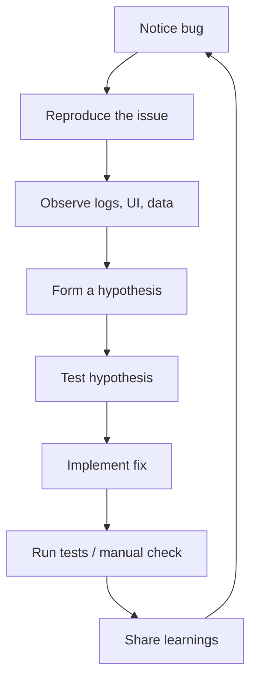

# Debugging Mindset: Find Bugs Without Killing the Vibe

Debugging is where teams either spiral or shine. Teach students to treat bugs as design challenges, collaborate intentionally, and use tooling to stay calm.

## Session goals

- Normalize bugs as part of the creative process.
- Equip learners with a repeatable debugging loop and key VS Code features.
- Encourage communication habits that keep pairing sessions productive.

## Reframe debugging

- Bugs are feedback, not failure. A failing test is a message from the system.
- Celebrate "good catches"—the earlier a bug is spotted, the less stressful it is.
- Encourage journaling: jot down steps, commands, and clues in a scratchpad.

## Core techniques

### 1. Reproduce reliably

- Document **exact steps** to reproduce (environment, inputs, branch).
- Capture screenshots or short Loom videos for asynchronous collaboration.
- If the bug only appears in production, gather logs, configs, and feature flags.

### 2. Inspect state

- Use VS Code debugger: set breakpoints, step over/into functions, and inspect variables.
- Watch expressions for values that change unexpectedly.
- For frontend work, open browser DevTools: inspect network requests, console output, and component state.

### 3. Log with intention

- Prefer structured logs (`console.log('User', { id, status })`).
- Tag logs with identifiers so multiple teammates can follow the story.
- Clean up noisy logs after fixing the bug to keep future debugging clear.

### 4. Hypothesize and test

- Form hypotheses based on evidence, not guesswork.
- Change one thing at a time; roll back if the hypothesis is wrong.
- Pair: explain your hypothesis out loud—often the explanation reveals gaps.

### 5. Verify and prevent regressions

- Add a regression test whenever possible (unit, integration, or end-to-end).
- Update documentation or README with new edge cases.
- Share the fix in stand-up: what was the root cause and the new guardrail?

## Communication rituals

- **Bug buddy system**: no one struggles alone longer than 20 minutes.
- **Rubber duck stand-ups**: quick check-ins where each person states what they're debugging and their latest clue.
- **Channel etiquette**: use threaded messages in Slack/Teams for each bug to track history.

## Lab: mystery bug challenge

1. Provide a small app with intentionally broken behavior (e.g., a todo list that loses items on refresh).
2. Students follow the debugging loop: reproduce, inspect, hypothesize, fix.
3. Require them to write a regression test or add debugging notes to the repo.
4. Wrap with mini retros: what signals did they follow, and how will they document the fix?

## Tooling checklist

- VS Code Debugger
  - Configure `.vscode/launch.json` for the stack (Node, Go, etc.).
  - Show how to use conditional breakpoints.
- Logging packages (e.g., `pino`, `winston`, `zap`) for structured logging beyond `console.log`.
- Browser extensions like React DevTools or Redux DevTools.
- Observability: introduce Sentry, Logtail, or DataDog early so errors get captured.

## Cheat sheet

| Issue | Quick check |
| ----- | ----------- |
| API returns 401 | Verify environment variables, auth tokens, and request headers. |
| Frontend not updating | Confirm state mutation patterns, `useEffect` dependencies, and realtime listeners. |
| Build fails locally | Ensure dependencies installed, node/go versions match, run `git clean -df`. |
| Tests flaky | Seed random data, wait for async operations, isolate side effects. |

## Reflection prompts

- What patterns made this bug harder to spot? How can we surface them earlier?
- Did we document the fix somewhere searchable (README, Notion, GitHub issue)?
- What defensive test or lint rule can prevent the next bug of this type?

## Resources

- [VS Code Debugging Docs](https://code.visualstudio.com/docs/editor/debugging)
- [Chrome DevTools Crash Course](https://developer.chrome.com/docs/devtools/)
- [How to Write a Good Bug Report](https://www.atlassian.com/agile/project-management/bug-tracking)
- Internal "bug museum" doc listing previous issues and their fixes.

## Next steps

- Pair this session with testing fundamentals to build confidence in writing regression tests.
- Encourage students to submit bug write-ups as part of their weekly reflections.
