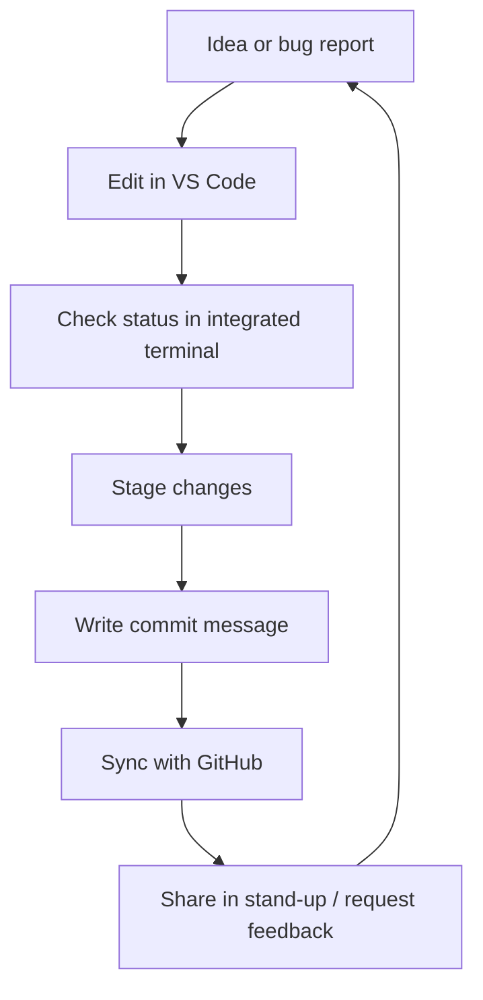

# Dev Environment Flow: Tools That Set the Vibe

Kick off the cohort by demystifying the tools everyone touches every session. This guide shows how the terminal, Visual Studio Code, and Git/GitHub fit together so newcomers feel confident pairing and shipping.

## Session goals

- Give students a story for how code moves from idea to a shared repo.
- Practice the basic loop: clone → code → commit → sync → celebrate.
- Highlight collaboration rituals that keep "vibe coding" fun and inclusive.

## Tool stack overview

### Terminal (integrated preferred)

- Open VS Code's integrated terminal with `` Ctrl+` `` (Windows/Linux) or `` Cmd+` `` (macOS).
- Practice key commands: `pwd`, `ls`, `cd`, `npm run dev`, `go run main.go`, etc.
- Encourage short aliases or scripts in `package.json` so nobody hosts command trivia night.
- Ritual: Before coding with a partner, run `git status` together to make sure the local tree is clean.

### Visual Studio Code workbench

- Panels to demo: **Explorer**, **Source Control**, **Extensions**, **Live Share**.
- Required extensions for the cohort: GitHub Pull Requests & Issues, Prettier, Live Share, Dotenv (call out what each does).
- Show the Command Palette (`Cmd/Ctrl+Shift+P`) as the "spotlight" for any action.
- Highlight self-care settings: font size, color theme, zen mode, accessibility options.

### Git & GitHub integration

- Use the Source Control view to stage files, add commit messages, and sync.
- Walk through the **Commit Graph** extension or GitLens to visualize history.
- Explain branch naming conventions, e.g., `feature/`, `fix/`, or the class-specific style.
- Show how GitHub Classroom or the org repo ties into their local clones.

## Live walkthrough

1. **Clone**: Students fork/clone the starter repo using VS Code's "Clone Repository" button.
2. **Setup**: Install dependencies with the integrated terminal and run the dev server.
3. **Code Together**: Pair on a tiny change (edit a welcome banner, tweak CSS, or add a console log).
4. **Check Git**: Use the Source Control diff to explain staged vs unstaged changes.
5. **Commit**: Write a short message (`Update hero banner copy`). Reinforce message structure: _verb + detail_.
6. **Sync**: Push changes and confirm they appear on GitHub. Optionally open a draft pull request.
7. **Reflect**: Call out what felt smooth or confusing; capture questions for follow-up.

## Classroom rituals

- **Opening systems check**: first five minutes of every session are dedicated to syncing the repo and pulling the latest changes.
- **Pair switches**: use Live Share or Git branches to keep hand-offs smooth.
- **Commit karaoke**: once per week, read favorite commit messages aloud to celebrate clarity and personality.
- **Help signals**: agree on how to ask for debug help without derailing the room (emoji in Slack, raised hand in Zoom, etc.).

## Troubleshooting cheatsheet

| Symptom | Likely fix |
| ------- | ---------- |
| `command not found` | Verify tools installed, check PATH, or run via package script. |
| `fatal: not a git repository` | Run `git status` to confirm location; if missing, initialize with `git init` or reclone. |
| Unable to push | Pull latest (`git pull --rebase origin main`), resolve conflicts, then push. |
| Dev server not restarting | Stop process (`Ctrl+C`), reinstall dependencies, or delete cached build assets. |

## Practice prompts

- Set up a new project folder from scratch, initialize Git, and connect it to GitHub.
- Break into trios: driver, navigator, storyteller. Rotate roles every 15 minutes while building a tiny feature.
- Document one "aha" configuration trick (like customizing VS Code snippets) and share it in the class knowledge base.

## Resources worth bookmarking

- [VS Code Beginner Fundamentals](https://code.visualstudio.com/docs/introvideos/basics)
- [GitHub Student Developer Pack](https://education.github.com/pack)
- [The Good Commit Message Guide](https://cbea.ms/git-commit/)
- Internal class wiki page for required extensions and setup scripts.

## Next steps

- Collect feedback after the session to find sticking points.
- Convert repeated fixes into automation (template repos, `npm run setup`, shell scripts).
- Line up the next tutorial: **Secrets & Safety** so the crew knows how to protect credentials before hitting third-party APIs.
