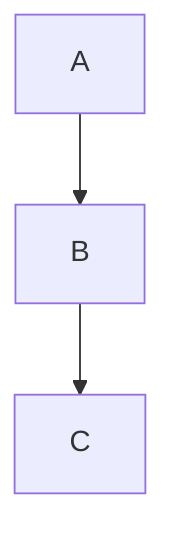

# Intro to Markdown

Markdown is a lightweight markup language for creating formatted text using a plain‑text editor. It’s ideal for READMEs, documentation, notes, and blog posts because it’s both readable in raw form and easy to convert to HTML.

## Why Markdown

- Fast, readable plain text
- Great for version control (diffs are clean)
- Supported across GitHub, GitLab, wikis, and docs tools

## Core Syntax

### Headings

```markdown
# H1
## H2
### H3
```

### Emphasis

```markdown
*italic* or _italic_
**bold** or __bold__
~~strikethrough~~
```

### Paragraphs & Line Breaks

- Blank line separates paragraphs.
- End a line with two spaces for a line break.

### Lists

```markdown
- Unordered item
  - Nested item
1. Ordered item
2. Next item
```

### Links & Images

```markdown
[link text](https://example.com)

```

### Code

- Inline: Use backticks: `const x = 1`
- Fenced code blocks with optional language for syntax highlighting:

````markdown
```bash
ls -la
```

````

### Blockquotes

```markdown

> A quoted line
>> Nested quote

```

### Tables

```markdown

| Col A | Col B |
|------:|:------|
|  123  | left  |

```

- Use `-` and `:` to align: left `:---`, right `---:`, center `:---:`

### Task Lists (GitHub Flavored Markdown)

```markdown

- [ ] Todo item
- [x] Done item

```

## Extended/Platform Features

Depending on the renderer (e.g., GitHub, docs tools), you may also get:

- Footnotes: `Here is a note.[^1]` then `[^1]: Footnote text`
- Definition lists, admonitions, callouts
- Mermaid diagrams:

````markdown



````

- Math (via extensions): `$E=mc^2$`

Check your target platform’s Markdown flavor and supported extensions.

## Writing Tips

- Favor headings and short paragraphs for scanability
- Use lists and tables to structure information
- Add alt text to images for accessibility
- Prefer relative links within the repo (e.g., `../path/file.md`)

## Common Pitfalls

- Forgetting blank lines around lists/tables can break formatting
- Mixing tabs/spaces in code fences can misalign blocks
- Relying on features not supported by your renderer

## Quick Reference Cheat Sheet

````markdown

# Title

A paragraph with `inline code` and **bold**.

- Item 1
- Item 2

1. Step one
2. Step two

> Note block

```js
function hello() { console.log('hi'); }
```

| Key | Value |
|----:|:------|
|  1  | one   |

````

## Online Resources

- Markdown Guide (Comprehensive): <https://www.markdownguide.org/>
- GitHub Flavored Markdown Spec: <https://github.github.com/gfm/>
- CommonMark Spec + Tutorial: <https://commonmark.org/>
- GitHub Markdown Cheatsheet: <https://github.com/adam-p/markdown-here/wiki/Markdown-Cheatsheet>
- Mermaid Diagrams: <https://mermaid.js.org/>

## Practice

- Create a new file `notes.md` and include at least: H1–H3 headings, unordered and ordered lists, a table, code block, and a task list.
- Open it in a renderer (e.g., GitHub preview or VS Code Markdown Preview: `Cmd/Ctrl+Shift+V`) to verify formatting.
