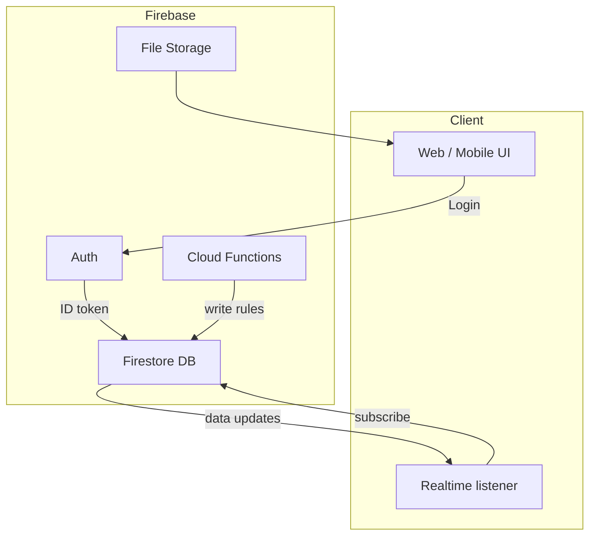
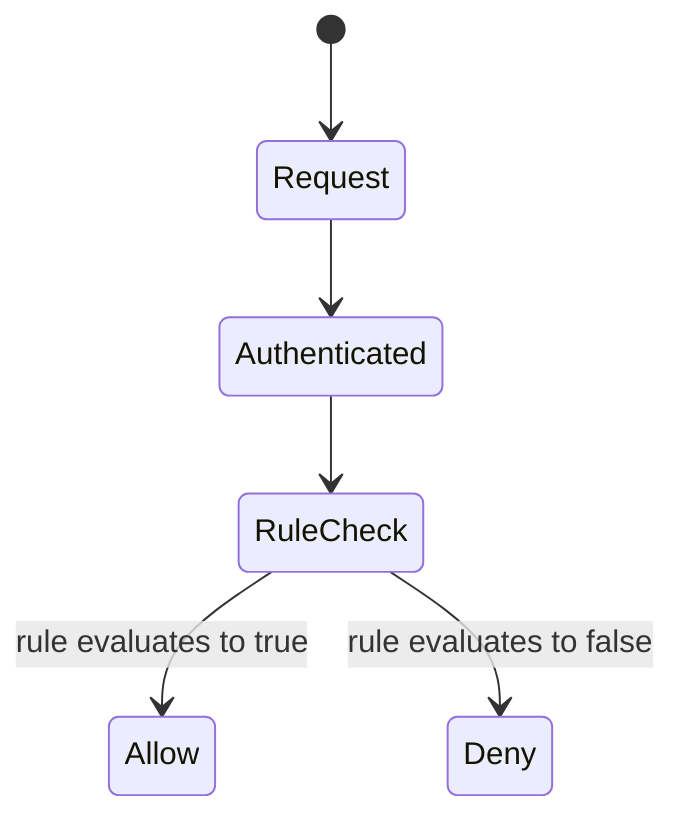

# Modern Data Foundations: Firebase and Realtime Backends

Introduce learners to the data platforms powering modern vibe-driven apps—chat tools, collaborative dashboards, live presence indicators, and more.

## Session goals

- Compare traditional databases with managed realtime platforms like Firebase, Supabase, and Appwrite.
- Explain core concepts: collections, documents, security rules, and realtime listeners.
- Build intuition for cost, scalability, and when to reach for each option.

## Database landscape snapshot

### Relational (SQL) classics

- Structured tables, joins, strong consistency.
- Runs on PostgreSQL, MySQL, SQL Server, etc.
- Best when you need complex queries, analytics, or legacy compatibility.

### Managed realtime services

- Firebase/Firestore, Supabase, Appwrite, Ably, Pusher.
- Deliver realtime events to clients with minimal backend code.
- Bundle auth, storage, and serverless functions.

### When to choose what

| Scenario | Pick | Why |
| -------- | ---- | --- |
| Solo project, rapid prototyping | Firebase or Supabase | Auth + DB + hosting in minutes. |
| Enterprise app, heavy reporting | PostgreSQL + custom backend | Control schema, migrations, analytics. |
| Hackathon chat app | Firebase Realtime DB | Built-in pub/sub style updates. |
| JAMstack content site | Supabase/Postgres or headless CMS | SQL plus REST/GraphQL APIs. |

## Firebase fundamentals

### Authentication

- Supports email/password, OAuth providers (Google, GitHub), phone auth.
- Delivers an **ID token** used to authorize reads/writes in Firestore.

### Firestore data model

- Hierarchical structure: `collections → documents → subcollections`.
- Documents are JSON-like objects with typed fields (string, array, map, timestamp).
- Lacks joins; you denormalize or precompute aggregates.

### Security rules

- Declarative rules determine who can read/write specific documents.
- Evaluate on every request and depend on auth context + document data.
- Encourage using Firebase Emulator to test rules before deploying.

### Realtime listeners

- Frontend subscribes to `onSnapshot` (Firestore) or `onValue` (Realtime DB).
- Server pushes updates over WebSockets; clients silently re-render.
- For React, use hooks (`useEffect`) to manage subscription lifecycle.

## Supabase and friends

### Supabase

- Built on PostgreSQL with realtime changefeeds via `pg_notify`.
- Ships with Row Level Security (RLS) policies similar to Firebase rules.
- Provides SQL editor, migrations, and Edge Functions.

### Appwrite

- Open source alternative: hosts your own server, offers database, auth, storage.
- Works well if you need on-prem or self-hosted compliance.

### Selection checklist

- **Data shape**: heavily relational? choose SQL-based. Document-style? Firestore fits.
- **Realtime**: how low-latency does the app need to be?
- **Ops comfort**: do you want to manage servers? Firebase handles infra, Supabase requires some oversight but still managed.
- **Cost**: evaluate free tier limits (reads, writes, storage, bandwidth).

## Hands-on mini-lab

1. Use Firebase Emulator Suite or Supabase local dev container.
2. Create a `presence` collection/table storing `{ uid, displayName, status }`.
3. On page load, set the current user to `status = "online"` and set up an `onDisconnect`/`beforeunload` hook to mark them `"offline"`.
4. Render a simple roster component that updates live as teammates join/leave.
5. Add basic security rules/RLS: only allow users to update their own presence document.

## Performance & cost tips

- Batch writes where possible; avoid writing on every keystroke.
- Cache reads locally (Redux Toolkit Query, React Query) to reduce billed reads.
- Use `limit()` queries, indexes, and `startAfter` for pagination.
- Monitor usage dashboards weekly to prevent surprise bills.

## Planning for scale

- Keep sensitive server logic in Cloud Functions or Supabase Edge Functions.
- Use feature flags to disable heavy listeners for low-capacity devices.
- Document data contracts early so future services can integrate without rewrites.
- Consider eventual migration paths (e.g., replicating Firestore to BigQuery).

## Resources

- [Firebase Fundamentals](https://firebase.google.com/docs) and [Firestore data model guide](https://firebase.google.com/docs/firestore/data-model).
- [Supabase Documentation](https://supabase.com/docs) and row level security walkthroughs.
- [Appwrite Docs](https://appwrite.io/docs) for self-hosted learners.
- [Firebase Emulator Suite](https://firebase.google.com/docs/emulator-suite) and [Supabase CLI](https://supabase.com/docs/reference/cli) for local development.

## Hosting & pricing snapshot

| Platform | Managed host | Free tier highlights | Starter cost expectations |
| -------- | ------------- | -------------------- | ------------------------- |
| Firebase (Firestore / Realtime DB) | Google Firebase (Spark/Blaze plans) | Spark plan: 1 GB storage, 50K reads/day, generous auth quota | Blaze pay-as-you-go typically lands $15–$60/month for an early-stage app with light realtime usage. Watch egress + function invocations. |
| Supabase (Postgres + realtime) | Supabase Cloud (Starter/Pro) | Free tier: 2 GB database, 2 GB file storage, 500 MB bandwidth | Pro plan starts at $25/month. Expect $25–$150/month once row counts or bandwidth increase. |
| Appwrite | Appwrite Cloud or self-host (Docker) | Cloud free tier: 500 MB DB, 1 GB storage. Self-host cost = infra only | Managed cloud from $15/month; self-host on Render/Railway/EC2 usually $10–$80/month depending on instance size. |
| AWS Amplify (DataStore + AppSync + DynamoDB) | AWS | Free tier for 12 months includes 1M AppSync requests, 25 GB storage | Pay-per-use after free tier; typical hobby app runs $20–$80/month, but spikes if GraphQL requests surge. |
| Supabase-compatible Postgres (Neon, Railway) | Neon, Railway, Fly.io | Free tiers with cold-start/usage caps | Paid plans often $15–$30/month to remove cold starts and get dedicated resources. |

> **Cost coaching tip:** Encourage teams to set budget alerts and log usage dashboards as part of weekly rituals. A surprise bill can derail morale fast.

## Next steps

- Pair this lesson with **Secrets & Safety** so credentials are managed correctly.
- In future sessions, contrast Firebase with building a custom REST API backed by PostgreSQL to show trade-offs.
