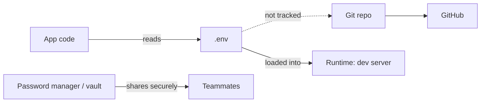

# Secrets & Safety: Environment Variables and Git Hygiene

Protect the vibe by protecting credentials. This tutorial shows why secrets matter, how environment variables work, and the Git habits that keep private data out of public repos.

> **🚨 Absolute rule:** Never commit secrets to Git. A single leaked API key can cost real money, expose user data, and erase trust. Always assume public repos are watched by bots hunting for credentials.

## Session goals

- Explain the risk of hard-coded API keys and leaked config files.
- Practice storing secrets locally with `.env` files and environment variables.
- Teach `.gitignore` as the first line of defense in every project.

## Stories that land

- Show a live [GitHub search for `path:.env` and `AWS_SECRET_ACCESS_KEY`](https://github.com/search?q=path%3A.env+AWS_SECRET_ACCESS_KEY&type=code) to illustrate how bots find exposed secrets. (Open in read-only mode—do **not** copy secrets.)
- Contrast a leak vs a cleanup using the Recipix repo commits: the [accidental API key commit](https://github.com/prvnX/recipix/commit/8712522b0524b74d8ce41c27277c7b77a59e304e) and the [follow-up fix replacing it with a placeholder](https://github.com/prvnX/recipix/commit/c73923317d764f9560fad15476d8da2e47ddc256).

## Environment variables 101

### What and why

- Environment variables are key–value pairs available to programs at runtime.
- They let you change behavior (API URLs, tokens, feature flags) without touching code.
- In production, hosting platforms usually inject them via dashboards or CI/CD.

### Local setup walkthrough

1. Create a `.env` file in the project root.
2. Add keys in `NAME=value` format, e.g., `SUPABASE_URL=https://...`.
3. Load them in code using the idiomatic approach for the language:
   - Node/React: `process.env.SUPABASE_URL`
   - Go: `os.Getenv("SUPABASE_URL")`
   - Python: `os.environ.get("SUPABASE_URL")`
4. Use a library like `dotenv` (JavaScript), `godotenv` (Go), or built-in framework helpers to load `.env` during development.

### Sharing secrets safely

- Create a `.env.example` template with placeholder values and instructions.
- Store actual values in a password manager, secret-sharing tool, or encrypted note.
- Never paste secrets into Slack, Discord, or email.
- Rotate credentials after someone leaves the project.

### Direnv workflow (advanced but powerful)

- Install [`direnv`](https://direnv.net/) and add the hook to your shell (`eval "$(direnv hook zsh)"`).
- Create a `.envrc` file that exports environment variables (`export SUPABASE_URL=...`).
- Authorize the file once with `direnv allow`; from then on, variables load automatically when you `cd` into the folder and unload when you leave.
- Keep `.envrc` out of Git (add it to `.gitignore`) and store real values in a secure manager like 1Password; share the script or template, not the secrets.
- Bonus: include `dotenv` support inside `.envrc` so teammates can opt into `.env` files if they prefer.

## Git hygiene

### `.gitignore` essentials

- Add `.env`, `.env.*`, `*.pem`, `node_modules`, and build artifacts to `.gitignore`.
- Run `git check-ignore -v FILENAME` if a file is unexpectedly tracked.
- Remember: `.gitignore` only affects new files. Use `git rm --cached` to remove secrets already committed.

### Pre-commit rituals

- Run `git status` before committing.
- Add a project-specific checklist: "Did I update `.env.example`? Did I commit any `.env` files?"
- Consider adding a pre-commit hook or `husky` script to block secret patterns using tools like [Gitleaks](https://github.com/gitleaks/gitleaks).

### Deployment-time secrets

- Every hosting provider (Vercel, Netlify, Render, Fly.io, Railway, AWS, etc.) has a secrets dashboard or CLI for injecting environment variables—use it instead of committing `.env` files.
- Sync values from your team password manager (1Password, Bitwarden, Vault, Doppler) into those dashboards; never copy production credentials into Git.
- Set up role-based access so only trusted maintainers can view or change production secrets.
- Document which secrets power which services so rotating credentials is painless.

## Lab: leak and recover

1. Instructor intentionally commits a dummy API key.
2. Students clone the repo, run `git log` to spot the leak, and demonstrate how a malicious actor could copy it.
3. Walk the group through revoking the key, force-pushing a rewritten history (if needed), and setting up `.gitignore`.
4. Finish by configuring Gitleaks or GitHub secret scanning.

## Quick reference

| Situation | Response |
| --------- | -------- |
| Secret accidentally committed | Revoke/rotate the key immediately, remove it from history, force-push if safe. |
| Need to share local config | Update `.env.example`, send actual values via secure channel. |
| CI build needs secrets | Use provider-specific env variable settings, not `.env` committed to repo. |
| Unsure if a file is safe | Ask peer/instructor before pushing; err on the side of not sharing. |

## Advanced moves

- Introduce secret managers (1Password, Doppler, AWS Parameter Store) for larger teams.
- Use `.env.local`, `.env.production`, etc., to separate environments in frameworks like Next.js or Remix.
- Automate secret linting in CI/CD pipelines.
- Leverage GitHub Actions `secrets` to deploy without exposing credentials in logs.

## Resources

- [GitHub Docs: Keeping your secrets safe](https://docs.github.com/en/actions/reference/security/secure-use)
- [Gitleaks Quickstart](https://github.com/gitleaks/gitleaks#quick-start)
- [Twelve-Factor App: Config](https://12factor.net/config)
- Internal class guide on required `.gitignore` entries.

## Next steps

- After this session, pair it with the **Modern Data Foundations** tutorial so students can safely connect to Firebase, Supabase, or other backends without leaking credentials.
- Revisit the topic mid-semester with a security retro to assess habits.
